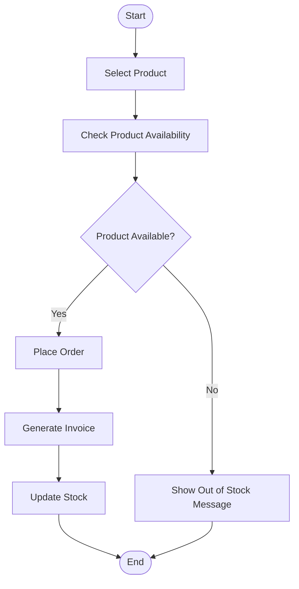

# QN.8 Draw the Activity Diagram for Inventory Management System

## Activity Diagram

An **Activity Diagram** is a UML behavioral diagram that represents the workflow of activities in a system. It shows the sequence of actions and decision points from the beginning to the end of a process.

### Components of Activity Diagram

* **Initial Node:** Starting point of the activity.
* **Activity:** A task or operation performed by the system or user.
* **Decision Node:** Represents a condition where the workflow branches.
* **Control Flow:** Shows the direction of the workflow.
* **Final Node:** Represents the end of the activity.

---

## Activity Diagram for Product Purchase

The following activity diagram represents the process of purchasing a product in the Inventory Management System.

---

## Activity Description

The customer selects a product and the system checks its availability. If the product is available, the order is placed, an invoice is generated, and the stock is updated. If the product is unavailable, an out-of-stock message is displayed.

---

## Conclusion

The Activity Diagram shows the workflow of the product purchase process and clearly represents the activities and decision involved in inventory management.
