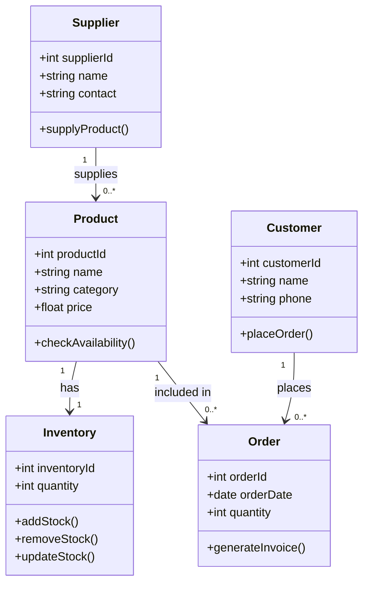

# QN.4 Draw the Class Diagram for Inventory Management System

## Class Diagram

A **Class Diagram** is a UML structural diagram that represents the classes, attributes, methods, and relationships of a system. It provides a blueprint of the system's structure.

### Components of Class Diagram

* **Class:** Represents an object or entity in the system.
* **Attribute:** Represents the data or properties of a class.
* **Method:** Represents the operations performed by a class.
* **Association:** Represents a relationship between classes.
* **Multiplicity:** Specifies the number of objects involved in a relationship.

---

## Class Diagram for Inventory Management System

The main classes include **Product, Supplier, Customer, Order, and Inventory**. These classes work together to manage products, stock, suppliers, and customer orders.

---

## Class Description

* **Product** stores information about products available in the inventory.
* **Inventory** maintains the quantity and stock status of products.
* **Supplier** provides products to the inventory.
* **Customer** places orders for products.
* **Order** records customer purchase information and generates invoices.

---

## Conclusion

The Class Diagram represents the static structure of the Inventory Management System by showing its main classes, attributes, methods, and relationships.
