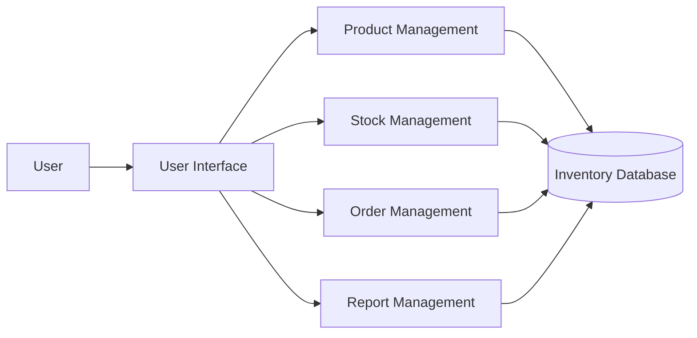

# QN.6 Draw the Component Diagram for Inventory Management System

## Component Diagram

A **Component Diagram** is a UML structural diagram that shows the major software components of a system and the dependencies between them. It represents how different modules work together to provide system functionality.

### Components of Component Diagram

* **Component:** A modular part of the software system.
* **Interface:** Defines how components communicate with each other.
* **Dependency:** Shows that one component depends on another.
* **Connection:** Represents communication between components.

---

## Component Diagram for Inventory Management System

The Inventory Management System consists of components such as User Interface, Product Management, Stock Management, Order Management, Report Management, and Database.

---

## Component Description

* **User Interface** provides the interface through which users interact with the system.
* **Product Management** handles adding, updating, and removing product information.
* **Stock Management** manages product quantities and stock updates.
* **Order Management** handles customer orders and invoices.
* **Report Management** generates inventory and sales reports.
* **Inventory Database** stores product, stock, order, and report-related data.

---

## Conclusion

The Component Diagram shows the major software components of the Inventory Management System and their dependencies. It provides a simple view of how different modules communicate with the database to perform inventory operations.
