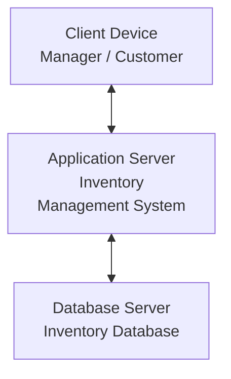

# QN.7 Draw the Deployment Diagram for Inventory Management System

## Deployment Diagram

A **Deployment Diagram** is a UML diagram that represents the physical deployment of software components on hardware devices or execution environments. It shows how different nodes communicate with each other.

### Components of Deployment Diagram

* **Node:** A physical device or execution environment.
* **Artifact:** Software deployed on a node.
* **Communication Path:** Connection between different nodes.
* **Deployment:** Represents software deployed on a particular node.

---

## Deployment Diagram for Inventory Management System

The Inventory Management System can be deployed using client devices, an application server, and a database server. Users access the application through client devices, while the application server communicates with the database server.

---

## Deployment Description

The **Client Device** is used by managers and customers to access the Inventory Management System. The **Application Server** runs the main inventory application and handles system operations. The **Database Server** stores product, stock, supplier, and order information.

---

## Conclusion

The Deployment Diagram shows the physical architecture of the Inventory Management System and illustrates how client devices, the application server, and database server communicate with each other.
