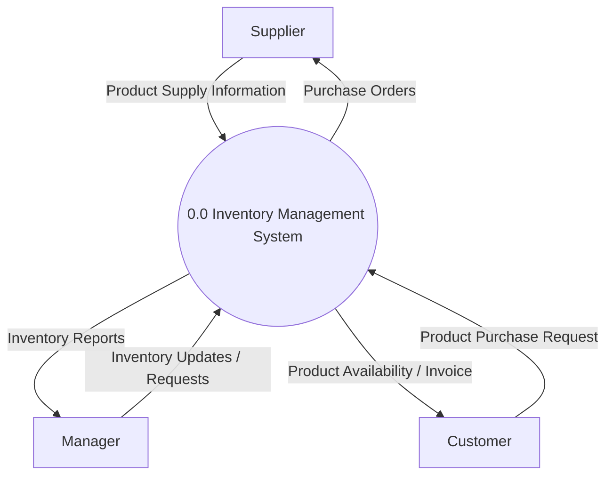
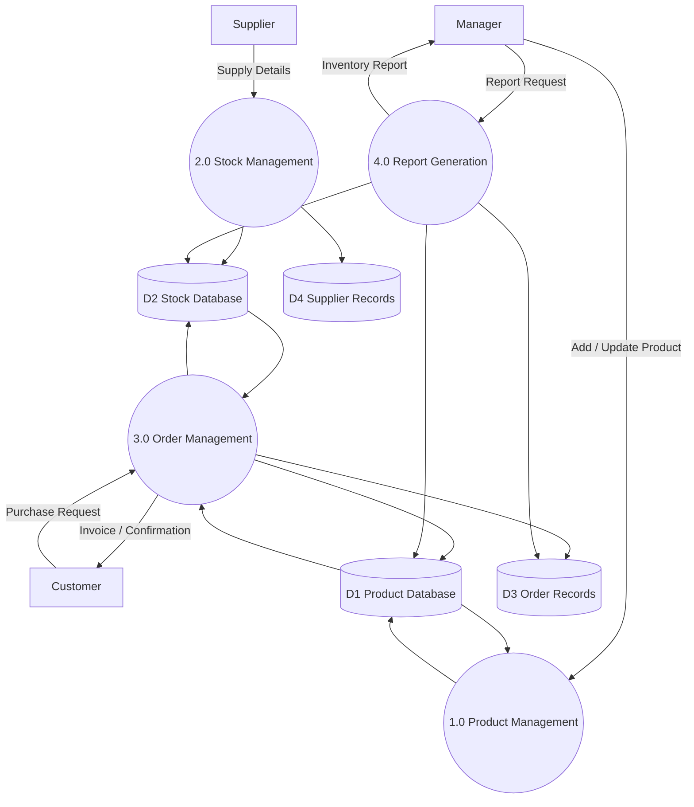

# QN.1 Write the DFD for Inventory Management System

## Data Flow Diagram (DFD)

A **Data Flow Diagram (DFD)** is a graphical representation of the flow of data through an information system. It shows how data enters the system, how it is processed, where it is stored, and how it is delivered to users.

### Components of DFD

* **External Entity:** Source or destination of data outside the system.
* **Process:** Activity that transforms input data into output data.
* **Data Store:** Place where data is stored.
* **Data Flow:** Movement of data between entities, processes, and data stores.

---

## Level 0 DFD (Context Diagram)

The Level 0 DFD represents the entire Inventory Management System as a single process and shows its interaction with external entities such as Supplier, Manager, and Customer.

---

## Level 1 DFD

The Level 1 DFD decomposes the Inventory Management System into major processes such as Product Management, Stock Management, Order Management, and Report Generation along with their respective data stores.

---

## Conclusion

The Level 0 DFD provides an overall view of the Inventory Management System and its interaction with external entities. The Level 1 DFD shows the internal processes, data stores, and data flow involved in managing products, stock, orders, and reports.
