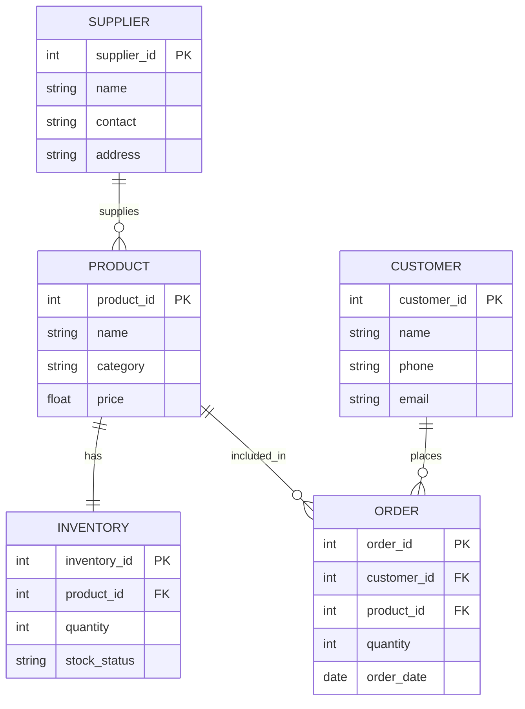

# QN.2 Draw the ER Diagram for Inventory Management System

## Entity Relationship (ER) Diagram

An **Entity Relationship (ER) Diagram** is a graphical representation of the entities, attributes, and relationships in a database system. It helps in designing and organizing the database structure.

### Components of ER Diagram

* **Entity:** A real-world object about which data is stored.
* **Attribute:** A property or characteristic of an entity.
* **Primary Key (PK):** Uniquely identifies each record.
* **Foreign Key (FK):** Connects one entity with another.
* **Relationship:** Shows the association between entities.

---

## ER Diagram for Inventory Management System

The main entities are **Product, Supplier, Customer, Order, and Inventory**. These entities maintain information about products, stock, suppliers, and customer orders.

---

## Relationship Description

* A **Product** has a corresponding inventory record that stores its stock information.
* A **Supplier** can supply multiple products.
* A **Customer** can place multiple orders.
* A **Product** can be included in multiple orders.

---

## Conclusion

The ER Diagram represents the database structure of the Inventory Management System by showing its main entities, attributes, and relationships. It provides a clear foundation for designing the system database.
