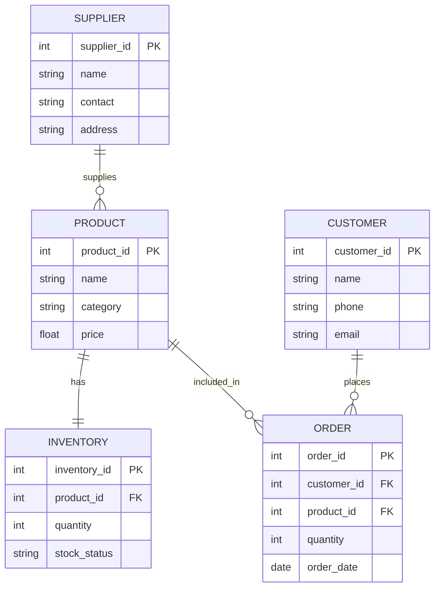

# QN.2 Draw the Physical Entity Relationship (PER) Diagram for Inventory Management System

## Physical Entity Relationship (PER) Diagram

A **Physical Entity Relationship (PER) Diagram** is a detailed representation of a database structure. It shows the entities, attributes, primary keys, foreign keys, data types, and relationships required for implementing the database. The PER diagram serves as a blueprint for database design and development.

### Components of PER Diagram

* **Entity:** A database table that stores related information.
* **Attribute:** A column that represents a property of an entity.
* **Primary Key (PK):** An attribute that uniquely identifies each record in an entity.
* **Foreign Key (FK):** An attribute that references another entity to establish a relationship.
* **Relationship:** An association between two or more entities.
* **Data Type:** Specifies the type of data stored in an attribute.

---

## PER Diagram for Inventory Management System

The Inventory Management System consists of the entities **Product, Inventory, Supplier, Customer, and Order**. These entities store information related to products, stock levels, suppliers, customers, and purchase transactions. The relationships among the entities define how inventory data is organized and maintained within the database.

## Diagram

```mermaid 
erDiagram

    PRODUCT {
        int product_id PK
        string name
        string category
        float price
    }

    INVENTORY {
        int inventory_id PK
        int product_id FK
        int quantity
        string stock_status
    }

    SUPPLIER {
        int supplier_id PK
        string name
        string contact
        string address
    }

    CUSTOMER {
        int customer_id PK
        string name
        string phone
        string email
    }

    ORDER {
        int order_id PK
        int customer_id FK
        int product_id FK
        int quantity
        date order_date
    }

    PRODUCT ||--|| INVENTORY : has
    SUPPLIER ||--o{ PRODUCT : supplies
    CUSTOMER ||--o{ ORDER : places
    PRODUCT ||--o{ ORDER : included_in
```

---

## Relationship Description

* A **Product** has a corresponding **Inventory** record that stores stock information.
* A **Supplier** can supply multiple **Products**.
* A **Customer** can place multiple **Orders**.
* A **Product** can be included in multiple **Orders**.

---

## Conclusion

The PER Diagram provides a detailed view of the Inventory Management System database by defining its entities, attributes, keys, data types, and relationships. It serves as the foundation for implementing and maintaining the database structure of the system.
