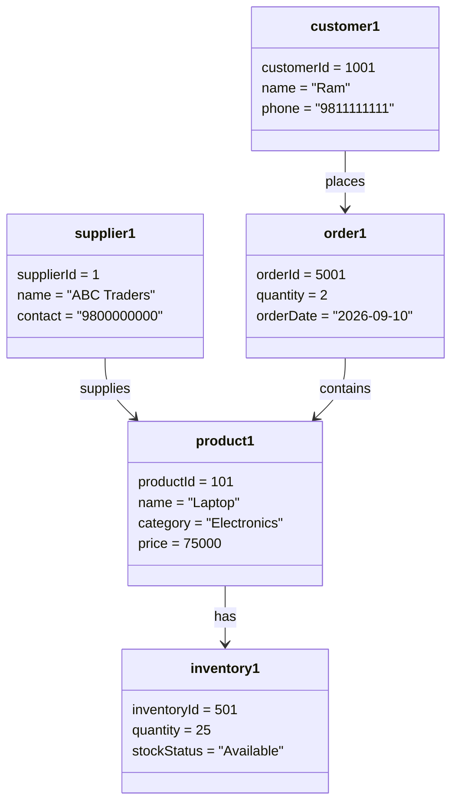

# QN.5 Draw the Object Diagram for Inventory Management System

## Object Diagram

An **Object Diagram** represents a snapshot of objects and their relationships at a particular point in time. It shows actual instances of classes with their attribute values.

### Components of Object Diagram

* **Object:** An instance of a class.
* **Attribute Values:** Actual values assigned to an object's attributes.
* **Link:** Relationship between two objects.

### Object Diagram for Inventory Management System

### Description

The **product1** object represents a specific product, Laptop, with its product ID, category, and price.

The **inventory1** object represents the inventory record of the laptop and stores its current quantity and stock status.

The **supplier1** object represents a specific supplier who supplies the laptop product.

The **customer1** object represents a customer named Ram who places an order.

The **order1** object represents a specific order containing two units of the laptop.

### Conclusion

The Object Diagram shows a **real-time snapshot of specific objects** in the Inventory Management System and illustrates how these objects are related to each other.
