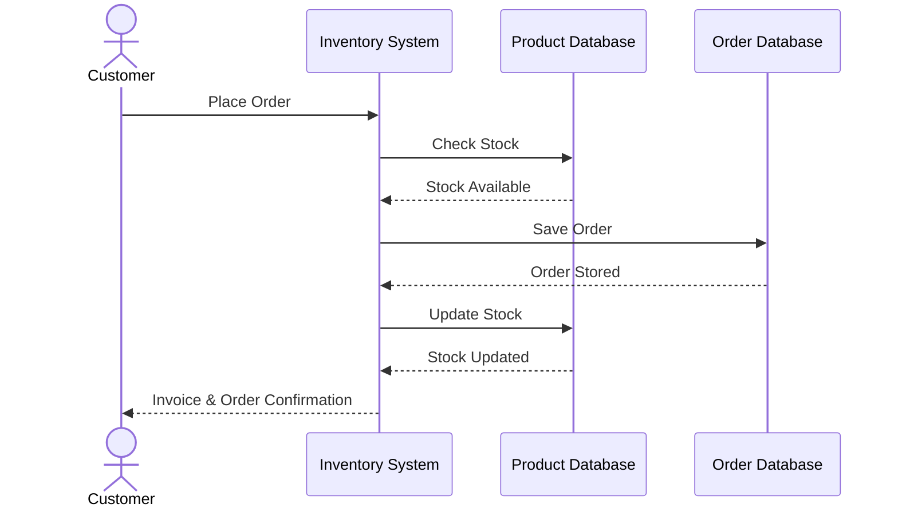

# QN.9 Draw the Sequence Diagram for Inventory Management System

## Sequence Diagram

A **Sequence Diagram** represents the interaction between objects or components of a system in a particular sequence over time. It shows how messages are exchanged between participants to perform a specific operation.

### Components of Sequence Diagram

* **Actor:** External user who interacts with the system.
* **Participant:** Object or system component involved in the interaction.
* **Message:** Communication between participants.
* **Sequence:** The order in which interactions occur.

### Sequence Diagram (Product Purchase Subset)

**Subset Used:** *Product Purchase Process*

### Description

The **Customer** starts the process by placing an order through the Inventory Management System.

The **Inventory System** checks the availability of the requested product from the Product Database. If the product is available, the system saves the order in the Order Database.

After successfully saving the order, the system updates the product stock quantity. Finally, the system sends the invoice and order confirmation to the customer.

### Conclusion

The Sequence Diagram shows the **step-by-step interaction between the customer, inventory system, and databases** during the product purchase process.
