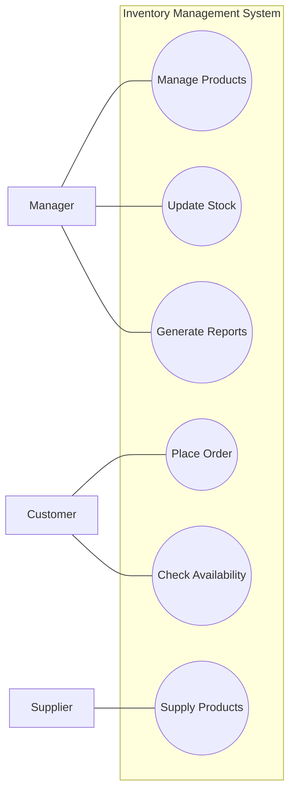

# QN.3 Draw the Use Case Diagram for Inventory Management System

## Use Case Diagram

A **Use Case Diagram** represents the functional requirements of a system by showing the interactions between users (actors) and the functions (use cases) provided by the system.

### Components of Use Case Diagram

* **Actor:** A user or external entity that interacts with the system.
* **Use Case:** A function or service provided by the system.
* **System Boundary:** Defines the scope of the system.
* **Association:** Shows interaction between an actor and a use case.

### Use Case Diagram for Inventory Management System

### Description

The **Manager** manages products, updates stock information, and generates inventory reports.

The **Supplier** supplies products to the inventory system.

The **Customer** checks product availability and places orders for available products.

The **Inventory Management System** provides these functions and manages the interactions between the actors.

### Conclusion

The Use Case Diagram represents the **functional interaction between the Manager, Supplier, Customer, and Inventory Management System**, providing a clear overview of the system's major functions.
