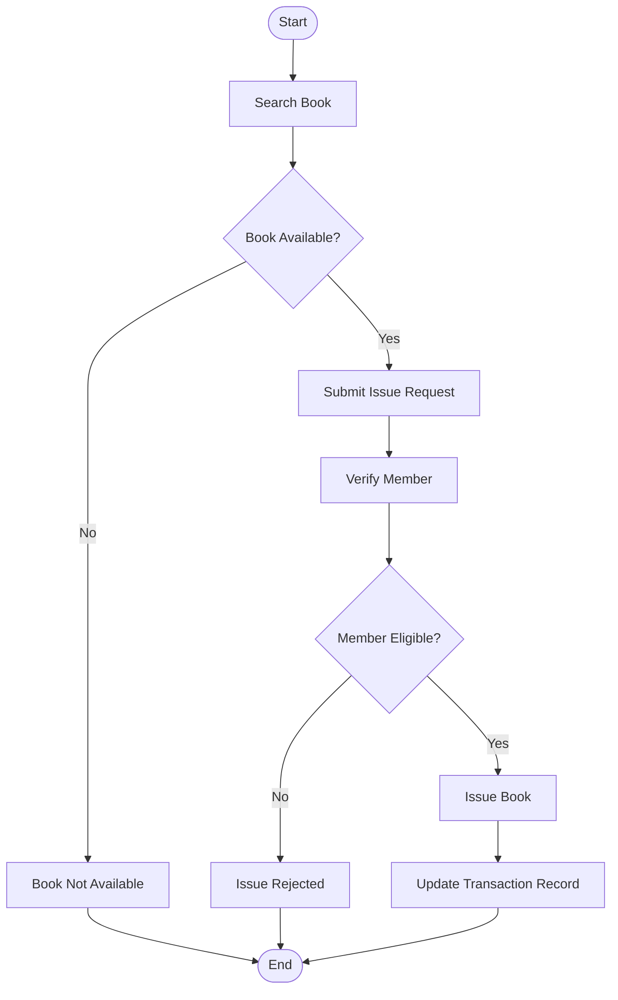

# QN.8 Draw the Activity Diagram for Library Management System

## Activity Diagram

An **Activity Diagram** is a UML behavioral diagram that represents the workflow of activities within a system. It shows the sequence of actions, decisions, and the flow of control from one activity to another.

### Components of Activity Diagram

* **Initial Node:** Starting point of the process.
* **Activity:** A task or operation performed.
* **Decision Node:** Represents a condition or branching.
* **Control Flow:** Direction of process execution.
* **Final Node:** End point of the process.

---

## Activity Diagram for Book Issue Process

The following activity diagram illustrates the workflow of issuing a book to a library member.

---

## Activity Description

* The member searches for a book.
* The system checks whether the book is available.
* If available, an issue request is submitted.
* Member eligibility is verified.
* If the member is eligible, the book is issued and transaction records are updated.
* Otherwise, the request is rejected.

---

## Conclusion

The Activity Diagram shows the workflow involved in issuing a book and helps visualize the sequence of activities and decision points within the process.
