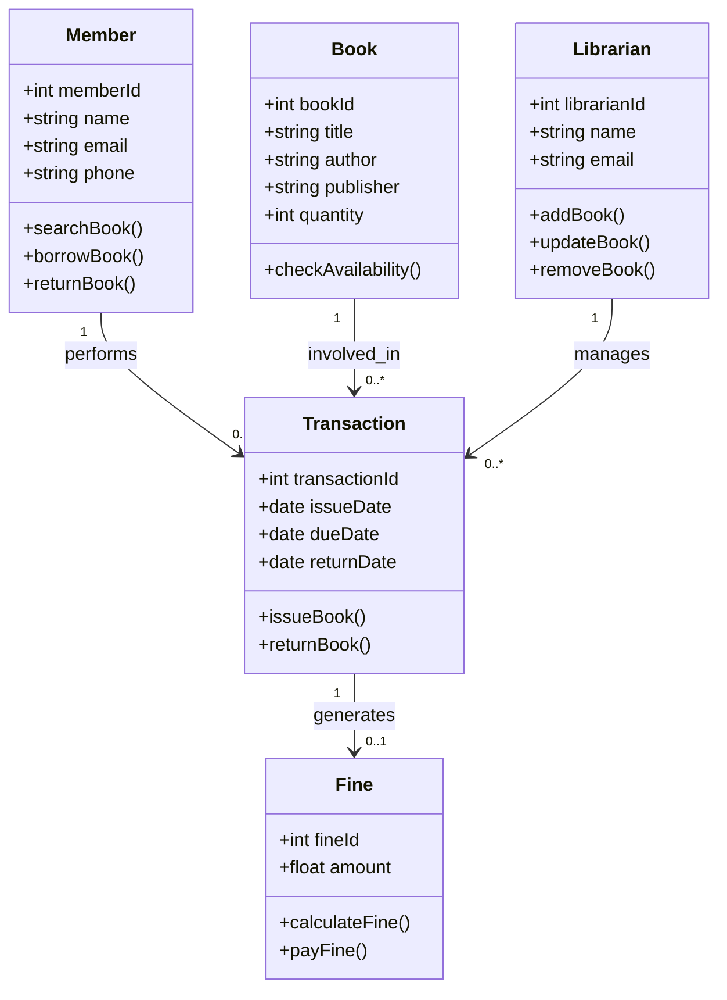

# QN.4 Draw the Class Diagram for Library Management System

## Class Diagram

A **Class Diagram** is a structural UML diagram that represents the classes of a system, their attributes, methods, and relationships. It provides a blueprint of the system's structure and is widely used during object-oriented design.

### Components of Class Diagram

* **Class:** Represents an object or entity in the system.
* **Attribute:** Data members of a class.
* **Method:** Functions or operations performed by a class.
* **Association:** Relationship between classes.
* **Multiplicity:** Specifies how many objects participate in a relationship.

---

## Class Diagram for Library Management System

The Library Management System consists of classes such as Member, Book, Librarian, Transaction, and Fine. These classes interact to perform book issue, return, and fine management operations.

---

## Class Description

* **Member** stores member information and performs borrowing and returning operations.
* **Book** stores book details and availability information.
* **Librarian** manages book records and library operations.
* **Transaction** records issue and return details of books.
* **Fine** stores overdue fine information and payment details.

---

## Conclusion

The Class Diagram represents the static structure of the Library Management System by showing classes, their attributes, methods, and relationships. It serves as the foundation for object-oriented design and implementation.
