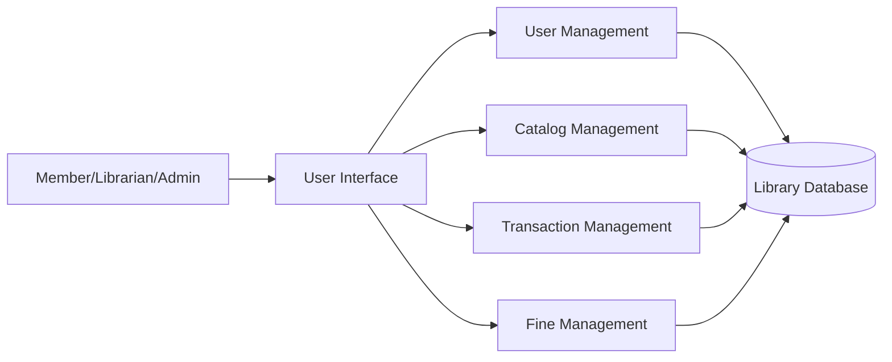

# QN.6 Draw the Component Diagram for Library Management System

## Component Diagram

A **Component Diagram** is a UML structural diagram that shows the organization and dependencies among software components of a system. It illustrates how different modules interact to provide system functionality.

### Components of Component Diagram

* **Component:** A modular part of the system that provides specific functionality.
* **Interface:** A point through which components communicate.
* **Dependency:** Relationship showing one component depends on another.
* **Connection:** Communication path between components.

---

## Component Diagram for Library Management System

The Library Management System consists of components such as User Management, Catalog Management, Transaction Management, Fine Management, and Database components that work together to provide library services.

---

## Component Description

* **User Interface** provides interaction between users and the system.
* **User Management** handles registration and user information.
* **Catalog Management** manages books and search operations.
* **Transaction Management** handles book issue and return processes.
* **Fine Management** calculates and manages fines.
* **Library Database** stores all system data.

---

## Conclusion

The Component Diagram shows the major software modules of the Library Management System and their dependencies. It helps in understanding the overall software architecture and module interactions.

---