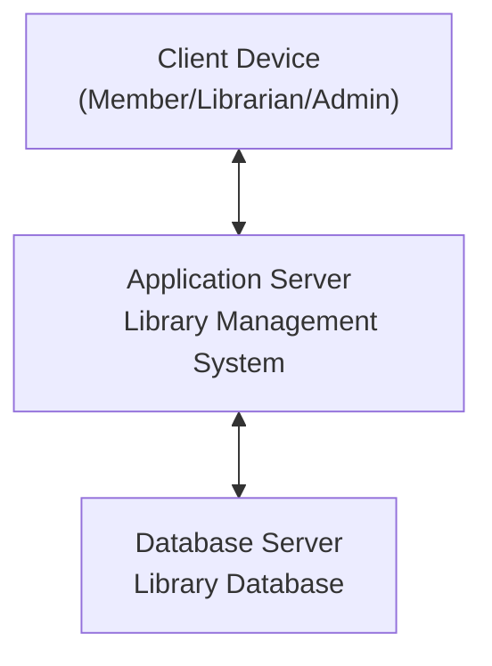

# QN.7 Draw the Deployment Diagram for Library Management System

## Deployment Diagram

A **Deployment Diagram** is a UML diagram that represents the physical deployment of software components on hardware nodes. It shows how software is distributed across servers, devices, and databases.

### Components of Deployment Diagram

* **Node:** Physical hardware device or execution environment.
* **Artifact:** Software deployed on a node.
* **Communication Path:** Connection between nodes.
* **Deployment Relationship:** Indicates where software components are installed.

---

## Deployment Diagram for Library Management System

The Library Management System is deployed on a client machine used by members and librarians, an application server hosting the system, and a database server storing library records.

---

## Deployment Description

* **Client Device** is used by members, librarians, and administrators to access the system.
* **Application Server** hosts the Library Management System application.
* **Database Server** stores member, book, transaction, and fine information.
* Communication occurs between client devices, the application server, and the database server.

---

## Conclusion

The Deployment Diagram illustrates the physical architecture of the Library Management System. It shows how the application and database are deployed on different nodes and how users access the system through client devices.
