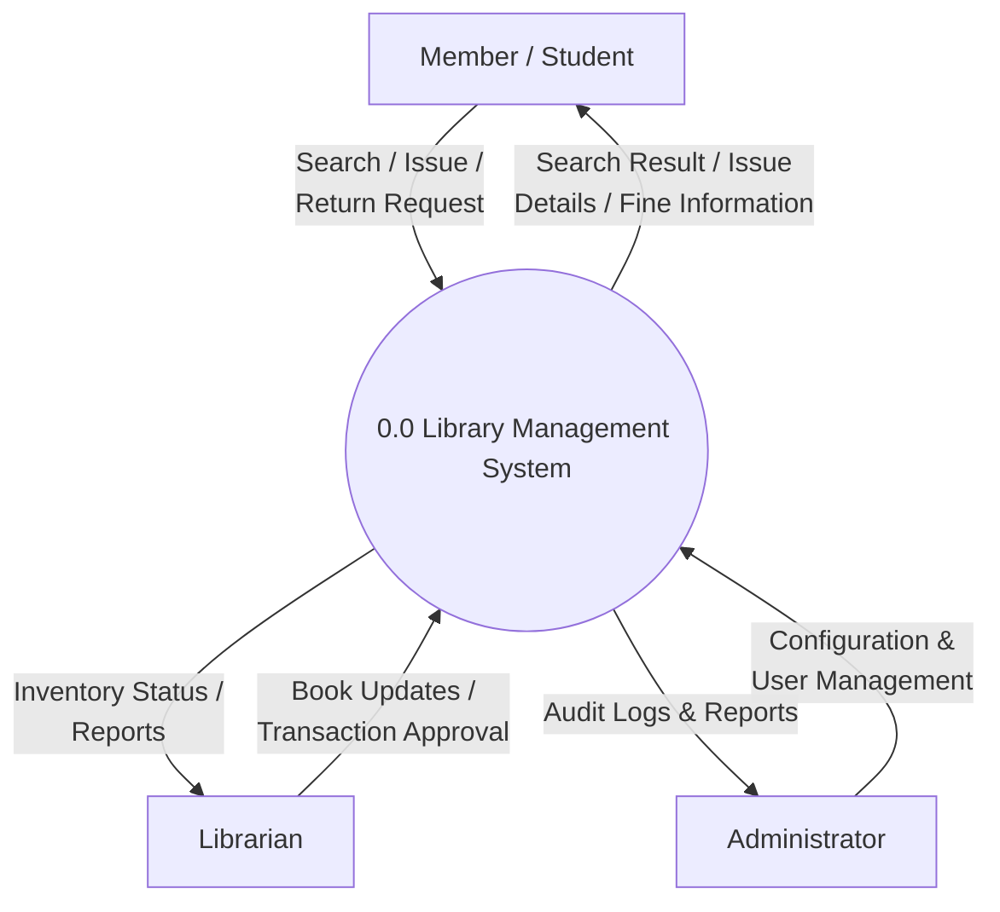
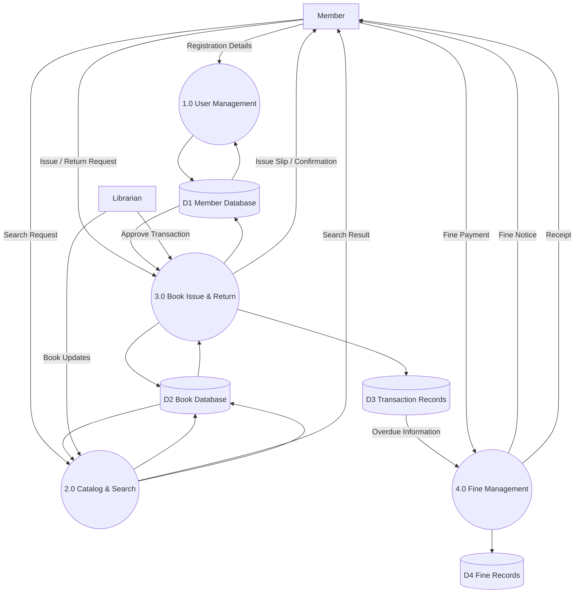

# QN.1 Write the DFD for Library Management System

## Data Flow Diagram (DFD)

A **Data Flow Diagram (DFD)** is a graphical representation of how data moves through a system. It shows the flow of data between external entities, processes, and data stores.

### Components of DFD

* **External Entity:** Source or destination of data outside the system.
* **Process:** Activity that transforms input data into output data.
* **Data Store:** Repository where data is stored.
* **Data Flow:** Movement of data between entities, processes, and data stores.

---

## Level 0 DFD (Context Diagram)

The Level 0 DFD represents the entire Library Management System as a single process and shows its interaction with external entities such as Member, Librarian, and Administrator.

---

## Level 1 DFD

The Level 1 DFD decomposes the Library Management System into major processes such as User Management, Catalog & Search, Book Issue & Return, and Fine Management. It also shows the data stores used by these processes.

---

## Conclusion

The Level 0 DFD provides a high-level view of the Library Management System and its interaction with external entities. The Level 1 DFD provides a detailed view of the internal processes, data stores, and data flows involved in managing library operations.
