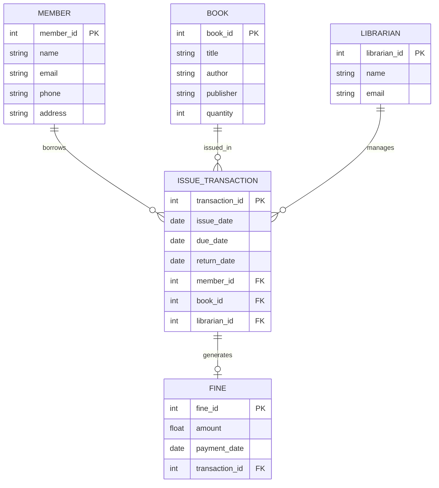

# QN.2 Draw the ER Diagram for Library Management System

## Entity Relationship (ER) Diagram

An **Entity Relationship (ER) Diagram** is a graphical representation of entities, their attributes, and the relationships between them in a database system. It is used during database design to model data requirements and relationships.

### Components of ER Diagram

* **Entity:** A real-world object or concept about which data is stored.
* **Attribute:** A property or characteristic of an entity.
* **Primary Key (PK):** An attribute that uniquely identifies an entity.
* **Foreign Key (FK):** An attribute that establishes a relationship between entities.
* **Relationship:** Association between two or more entities.

---

## ER Diagram for Library Management System

The Library Management System consists of entities such as Member, Book, Librarian, Issue Transaction, and Fine. The relationships show how members borrow books, librarians manage transactions, and fines are generated for overdue books.

---

## Relationship Description

* A **Member** can borrow many books through multiple issue transactions.
* A **Book** can be issued many times through different transactions.
* A **Librarian** manages issue and return transactions.
* An **Issue Transaction** may generate a fine if the book is returned late.
* Each fine is associated with a specific transaction.

---

## Conclusion

The ER Diagram identifies the main entities of the Library Management System and their relationships. It serves as the foundation for database design by defining how data is organized and connected within the system.
