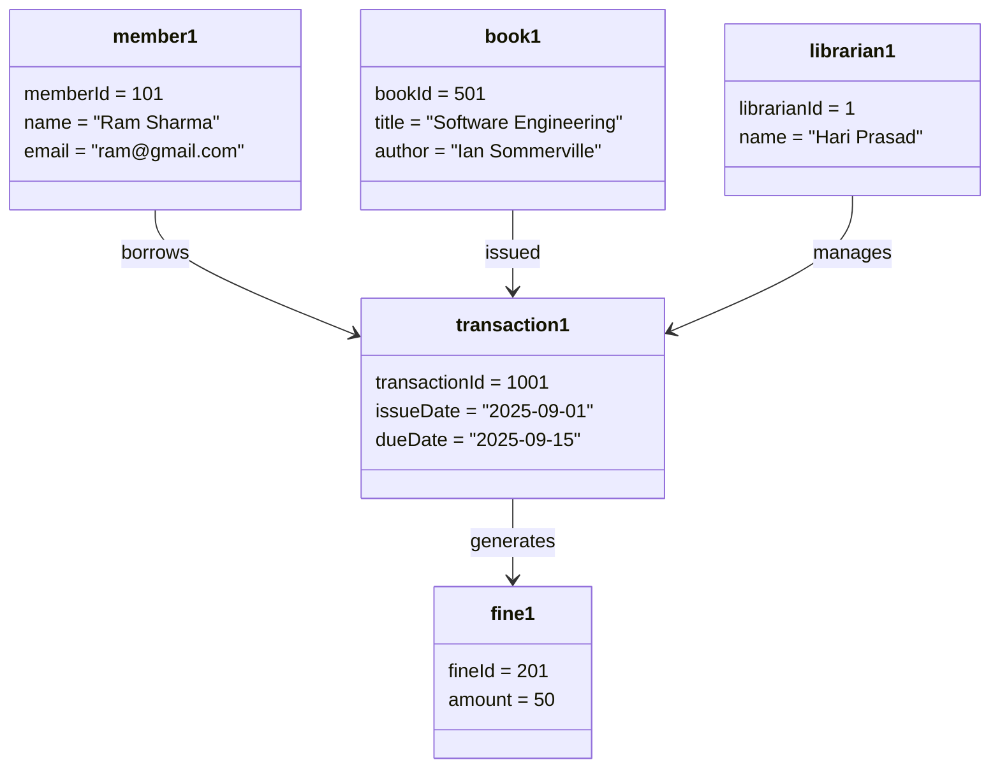

# QN.5 Draw the Object Diagram for Library Management System

## Object Diagram

An **Object Diagram** is a UML diagram that represents a snapshot of a system at a particular moment in time. It shows objects (instances of classes), their attribute values, and the relationships between them.

### Components of Object Diagram

* **Object:** An instance of a class.
* **Attribute Value:** Actual data stored in an object.
* **Link:** Connection between objects.
* **Instance:** A real-world occurrence of a class.

---

## Object Diagram for Library Management System

The Object Diagram shows actual instances of Member, Book, Librarian, Transaction, and Fine objects and their relationships during a book borrowing process.

---

## Object Description

* **member1** represents a library member named Ram Sharma.
* **book1** represents the book "Software Engineering".
* **librarian1** manages the transaction.
* **transaction1** records the issue details of the book.
* **fine1** represents the fine generated for late return.

---

## Conclusion

The Object Diagram provides a snapshot of the Library Management System at a specific time by showing actual objects and their relationships. It helps in understanding how class instances interact during system execution.
