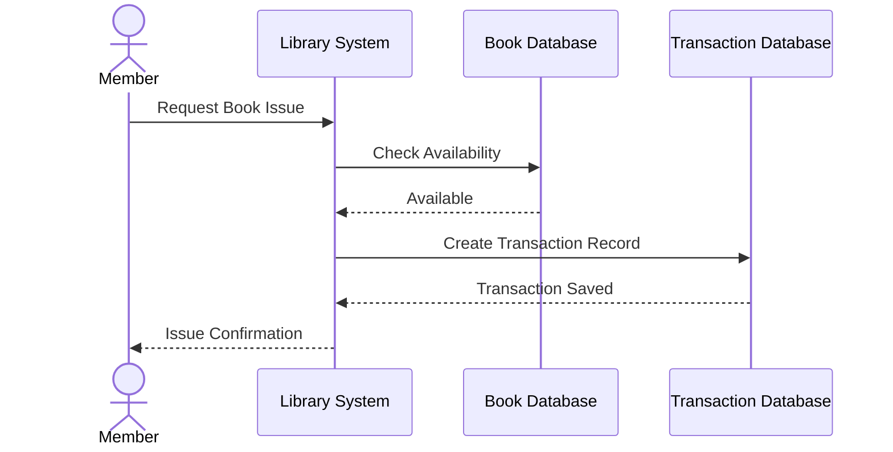

---

# QN.9 Draw the Sequence Diagram for Library Management System

## Sequence Diagram

A **Sequence Diagram** is a UML interaction diagram that shows how objects communicate with each other in a particular sequence of time. It focuses on the order of messages exchanged between system components.

### Components of Sequence Diagram

* **Actor:** User interacting with the system.
* **Object:** System component participating in communication.
* **Message:** Communication between objects.
* **Lifeline:** Represents the existence of an object over time.
* **Activation:** Execution of an operation.

---

## Sequence Diagram (Book Issue Subsystem)

**Subset Used:** *Book Issue Process only*

Instead of modeling the entire Library Management System, this sequence diagram focuses on the **Book Issue Process**, which involves a Member requesting a book, the system verifying availability, and recording the transaction.

---

## Sequence Description

* The member requests to issue a book.
* The Library System checks book availability in the Book Database.
* If available, a transaction record is created.
* The Transaction Database stores the issue information.
* The system sends an issue confirmation to the member.

---

## Conclusion

The Sequence Diagram illustrates the interaction between the member, system, and databases during the book issue process. By focusing on a specific subsystem, the diagram remains simple while clearly showing the order of message exchanges.

## Diagram Development Methodology

The diagrams presented in this report were designed using Mermaid, a text-based diagramming tool. Diagram structures were first written in Markdown using Mermaid syntax and then converted into graphical representations. The generated diagrams were exported as images and embedded into the final document prepared using Google Docs.