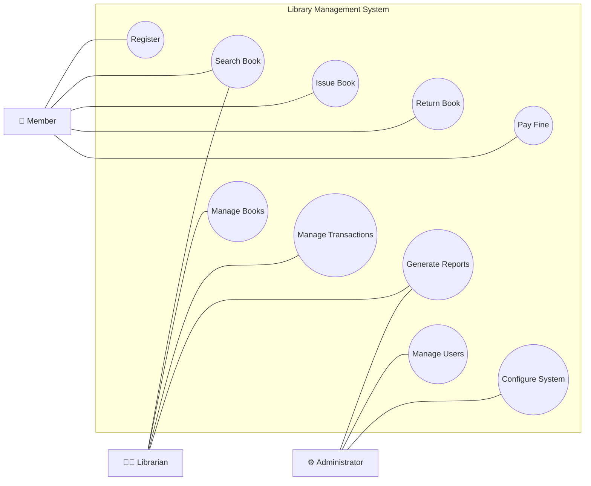

# QN.3 Draw the Use Case Diagram for Library Management System

## Use Case Diagram

A **Use Case Diagram** is a behavioral diagram in UML that represents the interactions between users (actors) and a system. It shows the functionalities provided by the system and identifies who can access them.

### Components of Use Case Diagram

* **Actor:** A person or external system that interacts with the system.
* **Use Case:** A function or service provided by the system.
* **System Boundary:** Defines the scope of the system.
* **Association:** Interaction between an actor and a use case.

---

## Use Case Diagram for Library Management System

The Library Management System allows members to search, borrow, and return books. Librarians manage books and transactions, while administrators manage users and system settings.

---

## Use Case Description

* **Member** can register, search books, issue books, return books, and pay fines.
* **Librarian** manages books, handles issue/return transactions, and generates reports.
* **Administrator** manages users, configures the system, and monitors reports.
* All use cases are performed within the Library Management System boundary.

---

## Conclusion

The Use Case Diagram provides a high-level view of the functionalities offered by the Library Management System and the interactions of different actors with those functionalities. It helps in understanding system requirements from the user's perspective.
